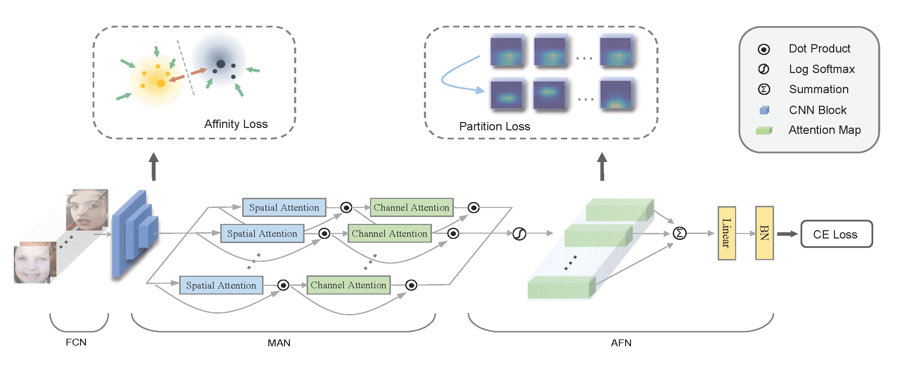

# Distract Your Attention: Multi-head Cross Attention Network for Facial Expression Recognition



A PyTorch implementation of the [DAN](https://arxiv.org/pdf/2109.07270.pdf), pre-trained models are available for deployment.


## Preparation
- Download pre-trained model of [MSCeleb](https://drive.google.com/file/d/1H421M8mosIVt8KsEWQ1UuYMkQS8X1prf/view?usp=sharing) and move the file to `./models`
- Download [RAF-DB](http://www.whdeng.cn/raf/model1.html) dataset and extract the `raf-basic` dir to `./datasets`
- Download [AffectNet](http://mohammadmahoor.com/affectnet/) dataset and extract the `AffectNet` dir  to `./datasets` 
- Run `python ./utils/convert_affectnet.py` to store a split version of AffectNet dataset.
  

## Training
We provide the training code for AffectNet and RAF-DB.  

For AffectNet-8 dataset, run:
```
CUDA_VISIBLE_DEVICES=0 python affectnet.py --epochs 10 --num_class 8
```
For AffectNet-7 dataset, run:
```
CUDA_VISIBLE_DEVICES=0 python affectnet.py --epochs 10 --num_class 7
```

For RAF-DB dataset, run:
```
CUDA_VISIBLE_DEVICES=0 python rafdb.py
```

## Models
Pre-trained models can be downloaded for evaluation as following:

|     task    	| epochs 	| accuracy 	| link 	|
|:-----------:	|:------:	|:--------:	|:----:	|
| AffectNet-8 	|    5   	| 62.09    	|[download](https://drive.google.com/file/d/1uHNADViICyJEjJljv747nfvrGu12kjtu/view?usp=sharing)      	|
| AffectNet-7 	|    6    	| 65.69     |[download](https://drive.google.com/file/d/1_Z-U7rT5NJ3Vc73aN2ZBmuvCkzUQG4jT/view?usp=sharing)  
|    RAF-DB   	|   21   	| 89.70    	|[download](https://drive.google.com/file/d/1ASabP5wkLUIh4VQc8CEuZbZyLJEFaTMF/view?usp=sharing)      	|


## Deployment

There is a simple demo to invoke DAN model for a emotion inference:
```
CUDA_VISIBLE_DEVICES=0 python demo.py --image test_image_path
```